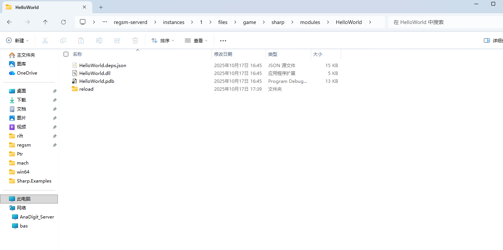
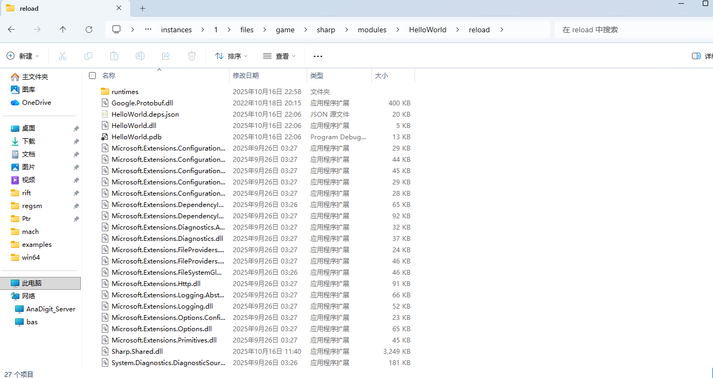

# 重新加载模块

重新加载模块是一个很常见的需求，比如说你改了东西想即时生效。  
操作也很简单，只需要将你新版本的模块编译到`{CS2}/game/sharp/modules/{你的模块}/reload`目录下即可，如图所示：

里面就是你想重新加载所使用的包，如图所示：

> [!NOTE]
> 你也可以用`{CS2}/game/sharp/modules/{你的模块}/{你的模块}`，依个人口味。

这时候换图就可以了。

