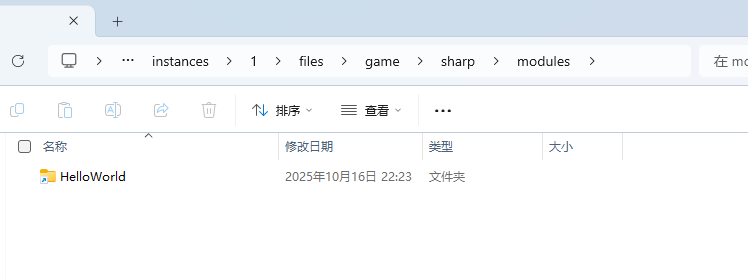
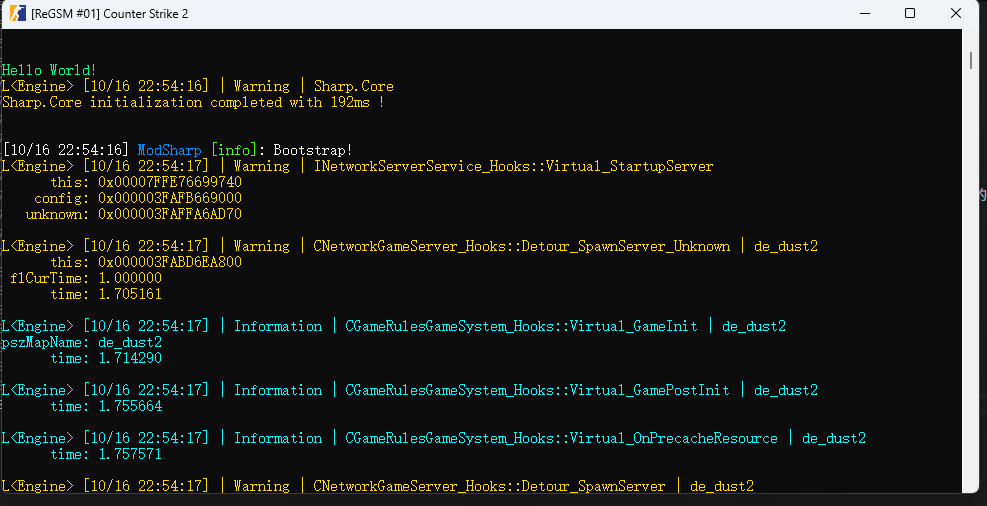
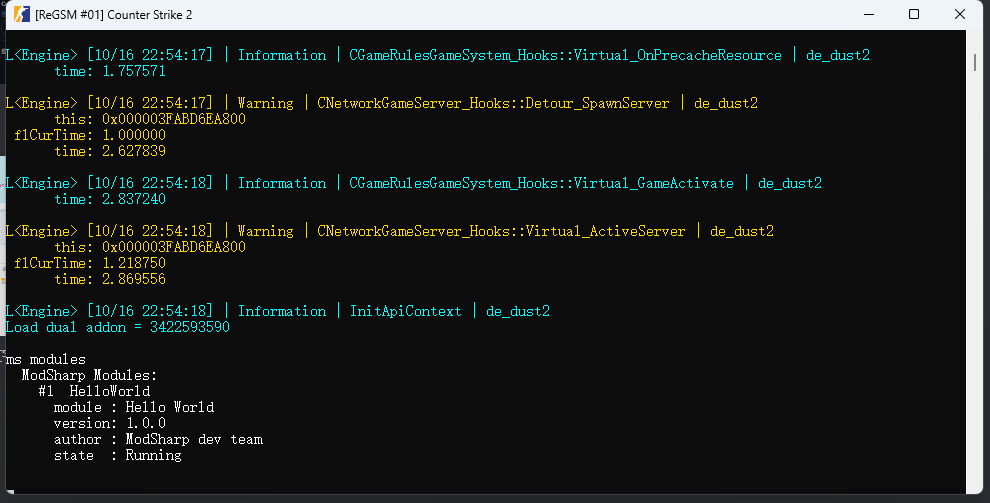

# 编写模块

## 项目参考

如果你已经有了一定的开发经验，你可以直接：

- 从模板创建：[ModSharp-Module-Template](https://github.com/new?template_name=ModSharp-Module-Template&template_owner=SourceSharp)
- clone示例：[ModSharp-Module-Example](https://github.com/SourceSharp/ModSharp-Module-Example)

如果你是萌新的话，那么。。。
下文我们将一步步介绍如何编写一个模块。

## 环境准备

当前版本的ModSharp使用的.NET版本是9.0，请确保你的.NET SDK版本至少在这个版本之上，否则无法进行接下来的步骤。

我们推荐你使用如下开发环境：

- Visual Studio 2022
- JetBrains Rider

> [!NOTE]
> 我们不是很推荐你用VS Code，原因是在你项目大了以后维护起来很痛苦。
> 本文的主要使用IDE均为Visual Studio。

我们将以「Example」作为示例项目名。

如果你想了解如何创建Solution和Class Library，请直接参阅此教程：[跳转连接](https://learn.microsoft.com/en-us/dotnet/core/tutorials/library-with-visual-studio)

当你创建了Class library后，你应该能找到Example.csproj，其应当长这样：

```xml
<Project Sdk="Microsoft.NET.Sdk">

  <PropertyGroup>
    <TargetFramework>net9.0</TargetFramework>
    <ImplicitUsings>enable</ImplicitUsings>
    <Nullable>enable</Nullable>
  </PropertyGroup>

</Project>
```

向该文件中添加如下内容：

```diff
<Project Sdk="Microsoft.NET.Sdk">

  <PropertyGroup>
    <TargetFramework>net9.0</TargetFramework>
    <ImplicitUsings>enable</ImplicitUsings>
    <Nullable>enable</Nullable>
+    <AssemblyName>Example</AssemblyName>
  </PropertyGroup>

+  <ItemGroup>
+    <PackageReference Include="ModSharp.Sharp.Shared" Version="2.0.15" PrivateAssets="all" />
+  </ItemGroup>

</Project>

```

到现在为止，你就已经可以给ModSharp写模块了。

> [!NOTE]
>
> 1. `ModSharp.Sharp.Shared`需要加上`PrivateAssets="all"`标签。这样可以防止你在某次更新以后出现问题，即使出现问题也更好排查。
> 2. 需要设置`AssemblyName`，否则可能会出现依赖加载不上的情况。该项的字段就和项目同名即可，我们的项目名是Example，所以该项填入的是Example，你实际开发的时候自行调整即可。

## Hello, World

所有的代码在执行前都需要一个入口，这里也不例外。

在新建Class library的时候，.NET会自动生成一个`Class1.cs`文件，我们就地取材，直接把这个文件改个名吧，就叫`Example.cs`，这个文件就是我们的模块入口文件。

然后向里面写入如下内容：

```cs
using Microsoft.Extensions.Configuration;
using Sharp.Shared;

namespace Example;

public class Example : IModSharpModule
{
    public Example(ISharedSystem sharedSystem, string dllPath, string sharpPath, Version version, IConfiguration configuration, bool)
    {

    }

    public bool Init()
    {
        Console.WriteLine("Hello, World!");
        return true;
    }

    public void Shutdown()
    {
        Console.WriteLine("Byebye, World!");
    }

    public string DisplayName => "Example";
    public string DisplayAuthor => "YourName";
}
```

其中：

```cs
public class Example : IModSharpModule
```

模块入口必须继承`IModSharpModule`，且一个模块中有且只能有一个类继承该接口，否则将会导致各种非预期行为。

> [!NOTE]
> 如果你一个solution中有多个模块，请将它们置于不同的模块包中，否则出现什么问题都不要觉得奇怪。

```cs
    public Example(ISharedSystem sharedSystem, string dllPath, string sharpPath, Version version, IConfiguration configuration, bool hotReload)
    {

    }
```

其为类的构造函数，你必须传入这些参数，否则模块将会直接初始化失败。

```cs
    public bool Init()
    {
        return true;
    }

    public void Shutdown()
    {
    }
```

- `Init()`在模块初始化时调用，必须实现，你如果不想写那么多可以直接`return true;`
- `Shutdown()`为模块卸载时调用，必须实现，你如果不想写可以直接留空，即直接空函数，里面不写任何东西。

```cs
    public string DisplayName => "Example";
    public string DisplayAuthor => "YourName";
```

- DisplayName为你模块显示名，这个任意取
- DisplayAuthor为模块作者，显示用，这个任意取

> [!NOTE]
> 这两项将会在`ms modules`中作为表明模块身份而出现。

## 编译，安装

你可以参阅[Microsoft Learn](https://learn.microsoft.com/zh-cn/dotnet/core/tutorials/publishing-with-visual-studio)

虽然说其为控制台应用，但所执行的步骤完全一致。

你也可以使用`dotnet publish`，这个更舒服。

请注意，`dotnet publish`的路径，必须放置到`{CS2}/game/sharp/modules/{你的模块名，绝大多数情况下为你的dll名}`
> 本教程为 `{CS2}/game/sharp/modules/Example`

当打包完成后:

- dll 路径应当是`{CS2}/game/sharp/modules/Example/Example.dll`
- deps路径应当是`{CS2}/game/sharp/modules/Example/Example.deps.json`

> [!NOTE]
> 模块路径请注意如下要点：
>
> 1. 不要有空格
> 2. 请使用大驼峰
> 3. 模块路径加载规则为`{CS2}/game/sharp/modules/{Module}/{Module}.dll`，请确保你模块包路径和对应的dll文件同名，否则也是无法加载的！

讲那么多你肯定比较懵，不如看图：



## 启动CS2

到这里就没什么好说的了，当你启动以后你应该能在服务端控制台看到`Hello World!`字样，到这里我们的入门模块就编写完成了。



你可以在启动后输入`ms modules`查询模块列表。

